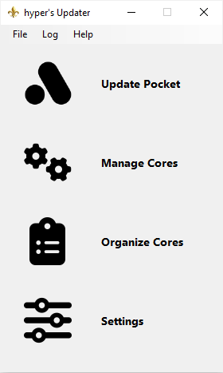
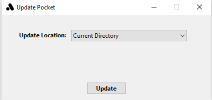
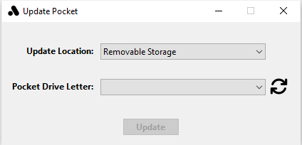
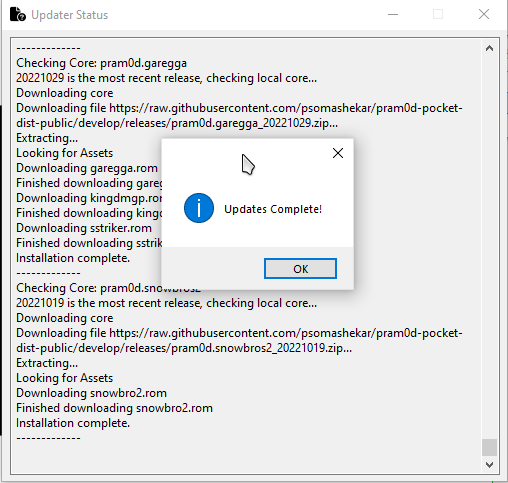
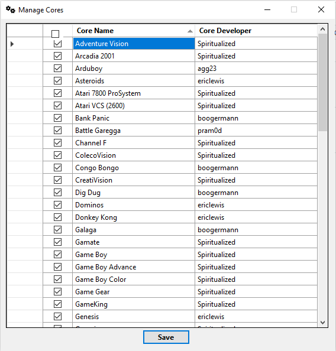
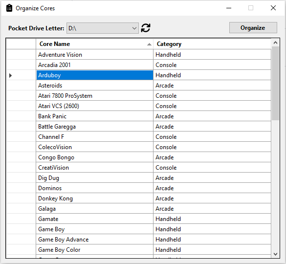
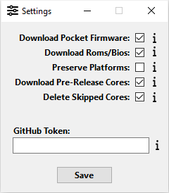
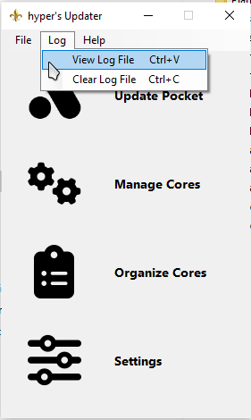
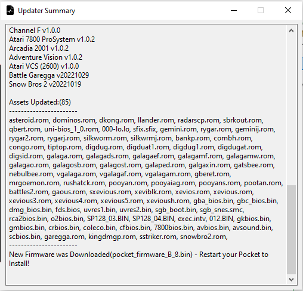
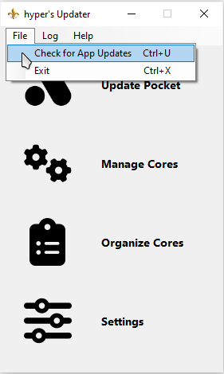

## Analogue Pocket Updater - Windows Application ##
This is a free Windows Application for updating the openFPGA Cores, Pocket Firmware, Required BIOS, and Arcade ROMS for your Analogue Pocket. This Application can be run from the Pocket's SD Card or from any location on your Windows Machine based on what fits your needs best.

## Updating ##

Select the "**Update Pocket**" Option

#### Current Directory Location
This option allows you to Update everything locally first and manually copy over all of the Files/Folders to your Pocket's SD Card after the Updater has finished. 

#### Removable Storage Location
This option allows you to Update directly to your Pocket's SD Card via plugging in your SD Card to your machine or by connecting your Pocket to your machine via USB Cable. (*Please use the Refresh button if you do not see your Pocket's SD Card Drive Letter within the Drop Down*)

Select the "**Update Cores**" Option and you will see a Status window as well as a message popup box when the Updates are done.

## Manage Cores ##
Select the "**Manage Cores**" Option. From here you can pick and choose the Cores that you'd like to download.

## Organize Cores ##
Select the "**Organize Cores**" Option. From here you can customize the Core Names and Categories to your liking.

## Settings ##
Select "**Settings**" Option

#### Download Pocket Firmware
This gives you the option to Check/Download Pocket Firmware.

#### Download Roms/Bios
This gives you the option to Check/Download the required Arcade Roms and Core Bios files.

#### Preserve Platforms
This gives you the option to keep any custom Core Images that you are using vs. the Stock Core Images. It will also preserve the entire Platforms folder which includes Core Names and Categories.

#### Download Pre-Release Cores
This gives you the option to Download any pre-release Cores. These Cores are typically beta/testing and likely to have some bugs.

#### Delete Skipped Cores
This will Delete Cores from your Pocket's SD Card that you have unchecked for Updating/Downloading
*This option will be Enabled by Default

#### GitHub Token
This is an Optional Setting. If you're running up against the rate limit with the GitHub API, you can provide your Personal Access Token to resolve this issue.

## Update Log ##

You can view the Update Log via "**Log --> View Log File**" or by Pressing "**CTRL+V**"

You can clear the Update Log File via "**Log --> Clear Log File**" or by Pressing "**CTRL+C**"

## App Updates ##
This Application will self check for Updates when you run it. When an Update is found you will get a Prompt asking if you'd like to Download the latest Release. 

You can manually check for App Updates as well via "**File --> Check for App Updates**" or by Pressing "**CTRL+U**"

## Credits ##
Special thanks to [mattpannella](https://github.com/mattpannella) for Collaborating with me and providing me with his Updater Library Files. His updater can be found [Here](https://github.com/mattpannella/pocket_core_autoupdate_net)
